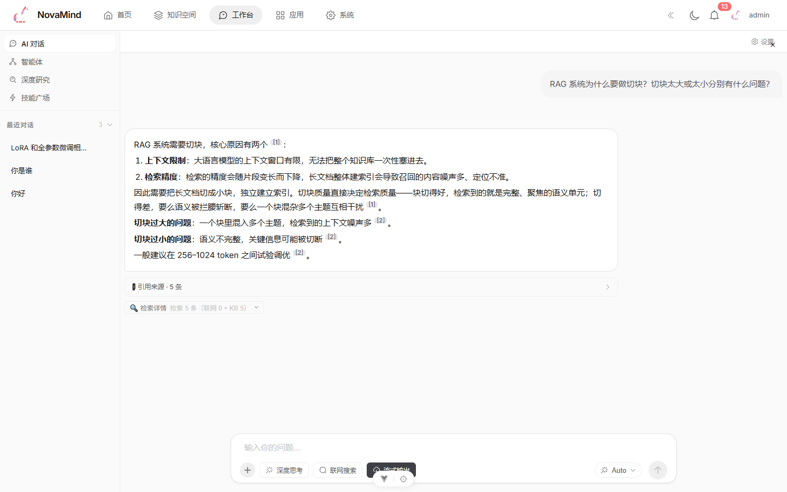
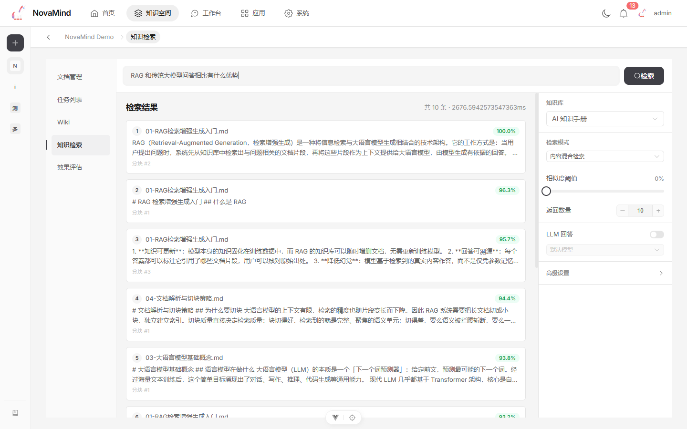
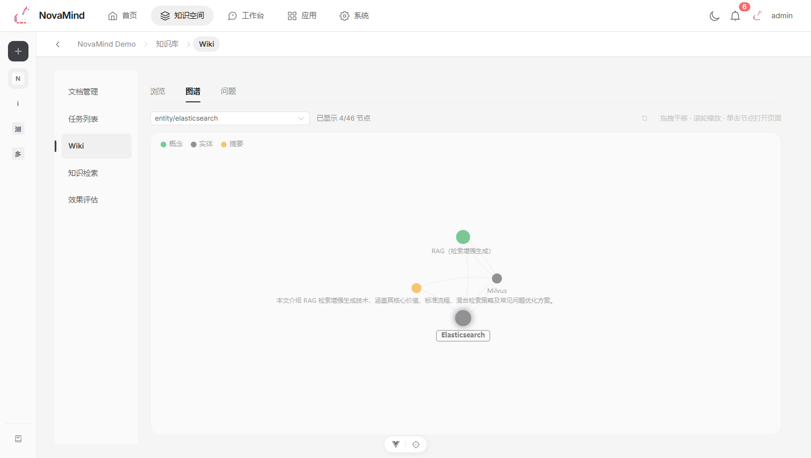
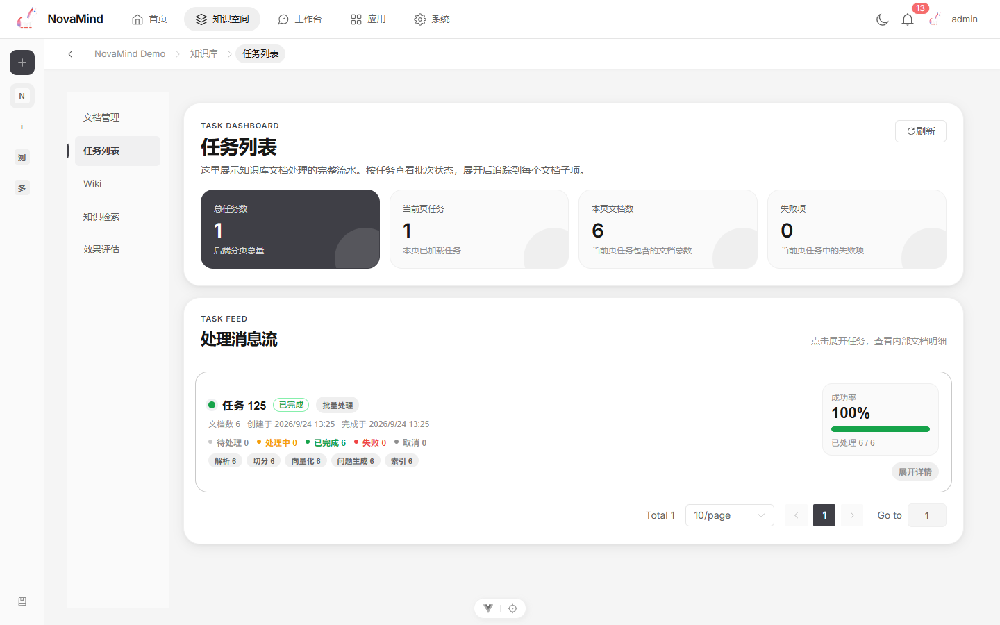
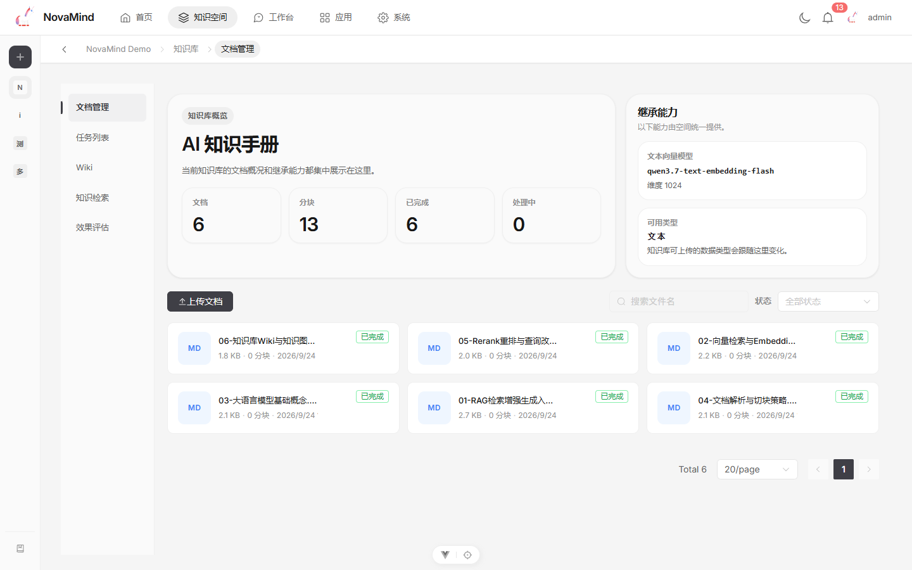
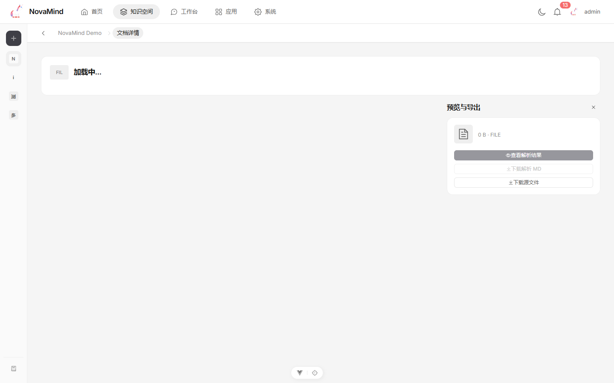
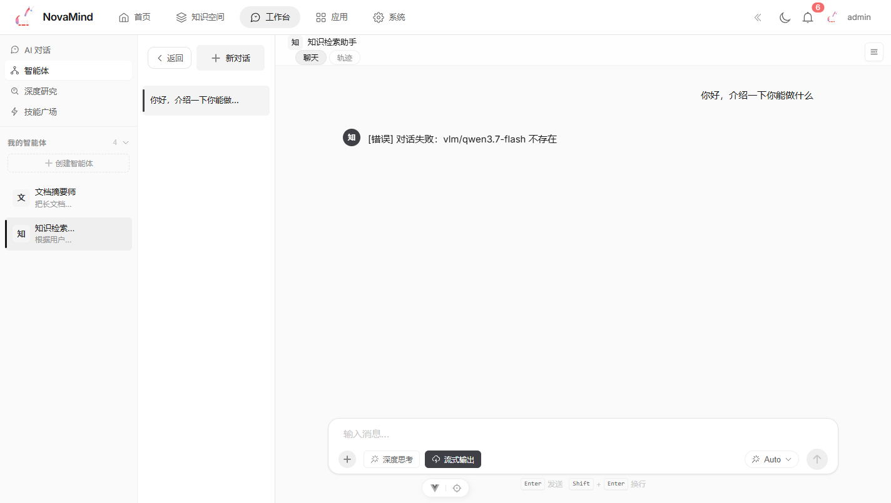
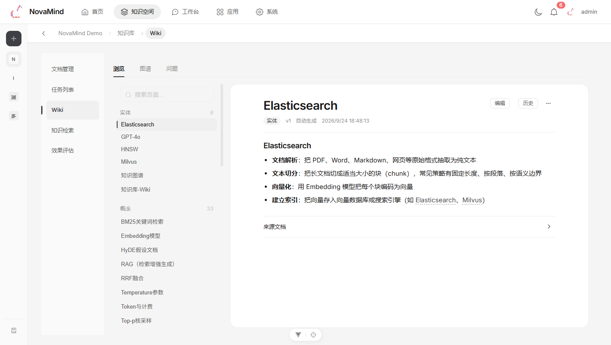

<div align="center">

# 🧠 NovaMind

**An all-in-one intelligent knowledge platform: knowledge bases · multimodal parsing · RAG QA · deep research · agents**

[](./LICENSE)
[](https://github.com/SpaceshiptoMoon/NovaMind/actions/workflows/ci.yml)
[](./backend/pyproject.toml)
[](./backend)
[](./frontend)
[](./frontend)
[](./docker-compose.yml)

**Documents in (PDF / scans / images / audio / video) — cited answers, structured wikis, and research reports out.**

English | [简体中文](./README.md)

</div>

<p align="center">
  
</p>

---

<div align="center">

| RAG QA with citations | Hybrid retrieval · 9 modes |
| :---: | :---: |
|  |  |
| **KB Wiki · knowledge graph** | **Document pipeline · task tracking** |
|  |  |

</div>

<details open>
<summary><b>📕 Table of Contents</b></summary>

- [What it is](#what-it-is)
- [Core capabilities](#core-capabilities)
- [Document processing pipeline](#document-processing-pipeline)
- [Knowledge-base Wiki](#knowledge-base-wiki)
- [Who it's for](#whos-it-for)
- [Tech stack](#tech-stack)
- [Quick start](#quick-start)
- [Access points](#access-points)
- [Architecture overview](#architecture-overview)
- [Repository layout](#repository-layout)
- [Modules](#modules)
- [Configuration](#configuration)
- [Model integration](#model-integration)
- [Security](#security)
- [Testing & quality checks](#testing--quality-checks)
- [Project status](#project-status)
- [Documentation](#documentation)
- [Open-source collaboration](#open-source-collaboration)
- [License](#license)

</details>

---

## What it is

Many knowledge-base projects only cover the "upload a document and chat" segment. NovaMind covers a more complete workflow:

- From spaces, knowledge bases, and document upload to **multimodal parsing** (text / image / video / audio), splitting, vectorization, and indexing
- From retrieval to RAG QA, and on to deep-research report generation
- From plain chat to agents with tool-calling, MCP extensions, and a skill marketplace
- From building capabilities to evaluation test sets, manual review, and result export
- From raw documents to auto-generated structured wikis, knowledge graphs, and quality linting

If you want to build more than a chat window — a system that can organize knowledge, execute tasks, and evaluate results — NovaMind is closer to a full workbench.

## Core capabilities

### 📚 Knowledge-base engine

- **Spaces & knowledge bases**: multi-space isolation, member collaboration (OWNER / ADMIN / EDITOR / VIEWER roles), per-KB parsing config, full document lifecycle
- **Hybrid retrieval**: vector, BM25, hybrid, rerank, query rewriting, and multi-level fallbacks — 9 retrieval modes
- **Hypothetical-question augmentation**: optionally generate hypothetical questions per chunk and index them as question vectors to improve recall
- **KB evaluation**: test-set management, automated evaluation, manual scoring, report export; distill QA messages into test sets in one click, and compare two reports to spot per-case regressions

<p align="center">
  
</p>

### 📄 Multimodal document parsing

- **Text documents**: PDF (DeepDoc full mode with per-span text layer + OCR fusion, or lightweight plain mode), DOCX, TXT, MD, CSV, HTML, JSON
- **Image understanding**: VLM-generated descriptions, or DeepDoc OCR for in-image text
- **Video parsing**: fixed-interval / scene-change / deduplicated frame sampling, per-frame (or grouped) VLM description, dual-anchor timeline alignment
- **Audio transcription**: local **faster-whisper** by default (free, no API key, model pre-downloaded at deploy time); switchable to cloud ASR (OpenAI Whisper / DashScope Paraformer)
- **Formulas & tables**: PDF formula recognition (pix2text-mfr INT8), table structure restoration with inline HTML
- **Resumable pipeline**: three-level content fingerprints (parse / split / embed) — retries reuse already-paid artifacts on fingerprint match; config changes cascade-invalidate downstream

<p align="center">
  
</p>

### 🤖 Intelligent apps

- **RAG QA**: multi-turn QA over knowledge bases, session config, context compression, answers with citation tracing — click "locate source" on a PDF citation to jump to the exact page with bbox-level highlighting of the cited region
- **Deep research**: combines internal KBs with external search (pluggable sources: Tavily / SerpAPI / DuckDuckGo), staged research-report generation
- **Agents**: tool calling, MCP server integration, execution-trace replay
- **Skill marketplace**: skill upload, review, install, and distribution
- **App center**: scenario-packaged AI capabilities (e.g. resume mining)

<p align="center">
  
</p>

### 🛡 Platform

- **Task system**: ARQ-based async task orchestration — batch processing, per-step progress, cancel / retry, zombie-task cleanup, crash recovery for orphaned tasks
- **Realtime notifications**: WebSocket push with polling fallback; parse completion / failure / cancel events
- **Space insights**: aggregated dashboard of QA thumbs-up/down, zero-hit and low-score queries — pinpoint knowledge gaps to guide document coverage
- **Multi-model access**: LLM / Embedding / Rerank / VLM / ASR — anything OpenAI-compatible plugs in; connection testing and encrypted key storage

## Document processing pipeline

Every document flows through one unified pipeline; the four modality branches share the tail (split → embed → hypothetical questions → ES indexing):

```text
Upload (MinIO original + hash dedup)
  └▶ ARQ async task
       ├─ text     DeepDoc / generic readers ────────┐
       ├─ image    VLM description / OCR ────────────┤
       ├─ video    frame sampling → VLM per frame ───┼─▶ split → Embedding
       └─ audio    local faster-whisper / cloud ASR ─┘     → hypothetical questions (optional)
                                                             → ES vector + full-text index
                                                             → Wiki generation (when KB enabled)
```

Pipeline reliability design:

- **Three-level content fingerprints** (parse / split / embed): retries reuse snapshots on fingerprint match, skipping expensive VLM / OCR / ASR / embedding calls; parsing or splitting config changes cascade-invalidate downstream
- **Per-step progress**: every step (parsed / split / embedded / indexed…) is persisted in real time; the task list visualizes execution traces, failures pin-point to the exact step
- **Transaction safety**: DB writes use SAVEPOINTs; queue jobs bind atomically to task rows; orphaned tasks are recovered automatically at startup after a crash
- **Full-text retention**: parsed text lands in MinIO immediately — chunking or embedding failures never lose parse results

## Knowledge-base Wiki

A traditional KB answers "where is this passage"; the Wiki answers "what is the full picture of this topic". NovaMind auto-generates a structured wiki from KB content (WeKnora-aligned design):

```text
KB documents ──parsed──▶ Wiki generation task (LLM planning + generation)
                            ├─ index pages: global navigation
                            ├─ topic pages: topic aggregation (multi-source merge)
                            └─ summary pages: per-document summaries
                                 │
                                 ├─▶ [[link]] resolution + knowledge-graph construction
                                 ├─▶ ES sync (wp-* chunks, retrieval boost 1.3x)
                                 └─▶ quality linting (six issue classes + health score)
```

<p align="center">
  
</p>

- **Frontend visualization**: wiki browser (page rendering + backlinks), force-directed knowledge graph (topic linking, node highlighting), issues panel (orphan pages / dead links / stale references / empty content and more — fix or ignore one by one, health score 0-100)
- **Generated pages sync into the ES retrieval index** with boosted ranking — QA can hit wiki entries directly
- **Agent integration**: QA agents can read wiki pages as a tool — "overview first, details second"
- **Lifecycle management**: document updates / deletions reconcile automatically (reparse merges updates, source deletion retracts pages) — no dangling references

<p align="center">
  
</p>

## Who it's for

- Teams or organizations that need an internal knowledge base with multi-space isolation and member permissions
- Mixed document formats: scanned PDFs, images, meeting recordings, training videos — all in one retrieval system
- A complete, observable, recoverable document pipeline: upload → parse → split → embed → retrieve → QA
- Chaining RAG QA, deep research, and agent tool-calling into one workflow instead of scattered tools
- An evaluation system (test sets, auto eval, manual scoring) to verify KB effectiveness
- Willing to run some infrastructure (MySQL, Redis, Elasticsearch, MinIO) in exchange for completeness and freedom

## Tech stack

| Category | Tech |
| --- | --- |
| Backend | FastAPI, Python 3.12, SQLAlchemy, Pydantic |
| Frontend | Vue 3, TypeScript, Vite, Pinia, Vue Router, Element Plus, ECharts |
| Database | MySQL 8.4 |
| Cache / Queue | Redis 7, ARQ (async tasks) |
| Search engine | Elasticsearch 9.3 (vector + BM25 hybrid retrieval) |
| Object storage | MinIO |
| Document parsing | DeepDoc (OCR / layout analysis / table restoration / formula recognition), pypdf, python-docx, … |
| Multimodal models | VLM (image / video-frame understanding), faster-whisper (local ASR), cloud ASR |
| Extension protocol | MCP (Model Context Protocol) |
| Deployment | Docker Compose, Nginx, Supervisord |

## Quick start

> [!IMPORTANT]
> **Prerequisites common to all three options**:
>
> - **On Linux self-hosting you must set `vm.max_map_count`**: Elasticsearch requires `vm.max_map_count >= 262144`; most Linux distributions default to 65530, which makes the ES container exit immediately on boot (log: `max virtual memory areas vm.max_map_count [...] is too low`). This applies to all three options whenever Elasticsearch runs in Docker.
>   ```bash
>   sudo sysctl -w vm.max_map_count=262144              # temporary (lost on reboot)
>   echo 'vm.max_map_count=262144' | sudo tee -a /etc/sysctl.conf  # permanent
>   ```
>   Docker Desktop (macOS / Windows) already handles this inside its Linux VM — no action needed.
> - **Prefer the HTTPS clone URL** (no SSH key setup needed): `git clone https://github.com/SpaceshiptoMoon/NovaMind.git`; use `git clone git@github.com:SpaceshiptoMoon/NovaMind.git` only if you have an SSH key configured.

### Option 1: one-command deploy

Recommended for a first run.

```bash
# Linux / macOS / Git Bash
bash deploy.sh

# Windows PowerShell (the default execution policy Restricted blocks script execution — use this command)
powershell -ExecutionPolicy Bypass -File deploy.ps1
```

The deploy script will automatically:

- Check the Docker and Docker Compose environment
- Generate `.env` from `.env.example`
- Generate random passwords, secrets, and the initial admin password
- Create `docker/configs/docker.yaml`
- Create `backend/src/setting/yaml_config/yaml/default.yaml`
- Build and start the full stack
- Download DeepDoc models at deploy time (OCR / layout / table / paragraph-merge XGBoost / formula recognition pix2text-mfr, several hundred MB total) into `backend/.cache/deepdoc`, mounted into the container via a compose volume (`/app/.cache/deepdoc`) so they survive container recreation; defaults to the `hf-mirror.com` mirror (`HF_ENDPOINT` overridable). **A failure here does not abort the deploy** — parsing degrades gracefully (formula recognition skipped, DeepDoc full mode unavailable) and you can retry later per the script's warning
- Download the local speech model (faster-whisper-tiny, ~75MB) into `backend/.cache/faster-whisper` (mounted as `/app/.cache/faster-whisper`) — audio documents transcribe locally by default; if the model is missing, audio parsing fails; retry per the script's hint
- Poll `http://localhost/health` for a health check

After deploy, the initial admin password is in `ADMIN_PASSWORD` in the root `.env`; **the default username is `admin`**.

Requirements:

- Docker 20.10+ (on Windows, Docker Desktop must be running)
- Docker Compose V2+
- One-command deploy via `deploy.sh` needs a working `python` command on the host (to generate random secrets; the script probes for it and offers an alternative when missing). `deploy.ps1` has no such dependency
- At least 2 CPU cores / 4 GB RAM / 20 GB disk (Elasticsearch uses a 512MB JVM heap by default; tune via `ES_JAVA_OPTS` in `.env`. The `--build` phase peaks higher — close other memory-heavy apps on small machines)
- For video parsing, local speech transcription, or DeepDoc full mode, 4 cores / 8 GB+ recommended

Common commands:

```bash
bash deploy.sh status
bash deploy.sh logs      # follows the app container only; add services to follow more (e.g. docker compose logs -f mysql)
bash deploy.sh update
bash deploy.sh stop
bash deploy.sh clean   # ⚠️ removes ALL data volumes (knowledge bases, documents, user data are lost); interactive confirmation included
```

```powershell
.\deploy.ps1 status
.\deploy.ps1 logs
.\deploy.ps1 update
.\deploy.ps1 stop
.\deploy.ps1 clean   # ⚠️ same as above — removes all data volumes
```

### Option 2: manual Docker deploy

If you prefer to control config files and passwords yourself:

```bash
git clone https://github.com/SpaceshiptoMoon/NovaMind.git
cd NovaMind

cp .env.example .env
cp docker/configs/docker.example docker/configs/docker.yaml
cp backend/src/setting/yaml_config/yaml/default.example backend/src/setting/yaml_config/yaml/default.yaml

docker compose up -d --build
```

> [!WARNING]
> **After `cp .env.example .env` you MUST edit `.env` and replace every `your-*` placeholder before starting**, otherwise:
>
> - The `ADMIN_PASSWORD` placeholder contains no uppercase letter / digit / special character. The first boot succeeds (with a weak password), but **the second restart enters a container crash loop** because the backend enforces password strength on the reset path. Admin password requirements: 8–30 chars with at least one uppercase letter, one lowercase letter, one digit, and one special character.
> - `SECRET_KEY` / `ENCRYPTION_KEY` placeholders are publicly known values from this repo — leaving them unchanged lets anyone forge JWTs and decrypt stored model API keys.
>
> Variables to replace: `MYSQL_ROOT_PASSWORD`, `MINIO_ROOT_USER`, `MINIO_ROOT_PASSWORD`, `ES_PASSWORD`, `SECRET_KEY`, `ENCRYPTION_KEY`, `ADMIN_PASSWORD`.

Notes:

- `.env` holds infrastructure passwords and backend secrets
- `docker/configs/docker.yaml` is the Docker runtime mount config
- `default.yaml` holds base backend config, mounted read-only into the container; `*.yaml` files are not baked into the image (only `*.example` templates are), so local real secrets never leak into image layers — sensitive values are usually overridden by environment variables
- Option 2 skips the deploy script's model download step, so two model groups are missing after first boot:
  - **DeepDoc models missing**: parsing degrades (formula recognition skipped, full mode unavailable, `/health/detailed` shows degraded). Download manually:
    ```bash
    docker compose run --rm --no-deps --user 0 \
      -e PYTHONPATH=/app/src \
      app python -m novamind.engines.document.integrations.deepdoc prepare --include-text-concat --include-formula
    ```
  - **Local speech model missing**: audio parsing fails (unless a cloud ASR is explicitly selected). Download manually:
    ```bash
    docker compose run --rm --no-deps --user 0 \
      -e PYTHONPATH=/app/src \
      -e NOVAMIND_LOCAL_WHISPER_MODEL_DIR=/app/.cache/faster-whisper/tiny \
      app python scripts/download_faster_whisper_model.py
    ```
  - **Download source**: model downloads read `HF_ENDPOINT` from `.env` (the default template ships the hf-mirror.com mirror; overseas users should switch to the official source). Commands above without an explicit `-e HF_ENDPOINT` stay consistent with `.env`.
  - **Linux host permission note**: the model cache dirs (`backend/.cache/deepdoc`, `backend/.cache/faster-whisper`) are written by `--user 0` (root) inside a host-created directory owned by the invoking user. The container's `appuser` (uid 1001) only needs **read** access normally; to enable runtime fallback downloads (auto-fetch of missing OCR models), pre-chown the dirs to the container user:
    ```bash
    sudo chown -R 1001:1001 backend/.cache
    ```

### Option 3: local development

For frontend/backend co-development or secondary development.

1. Prepare config files (both `.env` and YAML templates)

```bash
# from the repo root
cp .env.example .env                      # required: compose and the backend both read it; infra won't start without it

cd backend/src/setting/yaml_config/yaml
cp default.example default.yaml
cp development.example development.yaml
cd -                                      # back to the repo root
```

2. Start the infrastructure

Local development needs the following services running on `localhost`:

| Service | Purpose | Default port |
| --- | --- | --- |
| **MySQL 8.4** | business data persistence | 3306 |
| **Redis 7** | cache and async task queue | 6379 |
| **MinIO** | object storage for document originals and parse results | 9005 |
| **Elasticsearch 9.3** | vector + BM25 full-text retrieval | 9200 |

Recommended: start the infrastructure via Docker Compose (no app containers built):

```bash
docker compose up -d mysql redis minio elasticsearch
```

If you already run these services locally, just make sure their connection info matches the YAML config.

3. Start the backend

```bash
cd backend
uv sync           # install dependencies (install uv first: pip install uv, or curl -LsSf https://astral.sh/uv/install.sh | sh)
uv run python main.py --config development --reload
```

> **Config note**: all backend config is read from YAML files (`backend/src/setting/yaml_config/yaml/`); `${VAR_NAME}` placeholders in YAML are resolved from environment variables at runtime.
> The backend auto-loads the repo-root `.env` at startup (process environment variables take precedence), so placeholders resolve straight from `.env` — no manual export needed. See [Configuration](#configuration).

Default backend address: `http://localhost:8100`

> [!NOTE]
> **Audio / video parsing in local development**: the local speech model loads from `~/.cache/faster-whisper/tiny` by default; download it before first use:
> ```bash
> cd backend
> uv run python scripts/download_faster_whisper_model.py
> ```
> DeepDoc vision models (PDF full mode / formula recognition) likewise:
> ```bash
> uv run python scripts/download_deepdoc_models.py
> ```

4. Start the frontend

```bash
cd frontend
npm install
npm run dev
```

Default frontend address: `http://localhost:5173`

## Access points

Docker deploy:

| Service | Address | Credentials |
| --- | --- | --- |
| Frontend | `http://localhost` | admin account `admin`, initial password in `ADMIN_PASSWORD` in `.env` |
| Backend API docs | `http://localhost/docs` | same as above |
| Health check | `http://localhost/health` | none (process-liveness only; dependency health is at `/health/detailed`) |
| MinIO console | `http://localhost:9001` | `MINIO_ROOT_USER` / `MINIO_ROOT_PASSWORD` from `.env` |
| Elasticsearch | `http://localhost:9200` | none (ES security features are disabled in Docker deploy) |

Local dev:

| Service | Address |
| --- | --- |
| Frontend dev server | `http://localhost:5173` |
| Backend API docs | `http://localhost:8100/docs` |
| Backend health check | `http://localhost:8100/health` |

## Architecture overview

<p align="center">
  
</p>

The default Docker form is "single app container + multiple infra containers":

- The `app` container runs `Nginx + frontend static assets + FastAPI + embedded ARQ worker`
- `mysql`, `redis`, `minio`, `elasticsearch` run as separate services; infra ports are bound to `127.0.0.1`, not exposed publicly
- Nginx exposes port `80` and routes by path to static assets or FastAPI; FastAPI listens on `8100` inside the container, reachable only by Nginx

The backend uses a domain-oriented directory layout — `features/` for business modules, `engines/` for reusable engines, `shared/` for cross-module infrastructure:

```text
src/features/{module}/           business modules (domain layer)
|- api/                          thin route layer (registered in router_manager)
|- services/                     business orchestration
|- repository/                   data access (writes use SAVEPOINTs)
|- models/                       ORM models
`- schemas/                      Pydantic request/response models

src/engines/{engine}/            reusable engines (document/rag/agent/eval/search/…)
src/shared/                      model client factories / storage / MQ / prompt registry
src/core/                        app factory / middleware / auth / lifecycle
```

## Repository layout

```text
NovaMind/
|- backend/                         # FastAPI backend
|  |- main.py
|  |- pyproject.toml
|  |- scripts/                      # model download scripts (DeepDoc / faster-whisper)
|  |- src/
|  |  |- core/                     # app factory, middleware, lifecycle, security
|  |  |- engines/                  # engine layer: document / rag / agent / eval / search / deep_research / resume
|  |  |- features/                 # domain modules (user / knowledge_space / qa / agent / …)
|  |  |- setting/                  # YAML config loading
|  |  `- shared/                   # shared infrastructure (storage/ai_models/mq/document/…)
|  `- tests/                       # layered by test target (architecture/core/shared/engines/features)
|- frontend/                       # Vue 3 + TypeScript frontend
|  |- src/
|  |  |- api/                      # typed API clients grouped by domain
|  |  |- components/               # domain components (knowledge/agent/chat/…)
|  |  |- router/
|  |  |- stores/                   # Pinia
|  |  `- views/                    # route-level pages (space/agent/research/skill/…)
|- docker/                         # Dockerfile, Nginx, Supervisord, config templates
|- docs/                           # design docs and navigation docs
|- docker-compose.yml
|- deploy.ps1
|- deploy.sh
`- README.md
```

## Modules

| Module | Route prefix | Notes |
| --- | --- | --- |
| User & model config | `/api/v1/user` | auth, user management, five model types with connection testing |
| Knowledge spaces | `/api/v1/spaces` | space management, members, permission isolation |
| Knowledge bases | `/api/v1/spaces/{space_id}/knowledge-bases` | KB create, config, document management |
| Knowledge retrieval | `/api/v1/spaces/{space_id}/knowledge-bases/{kb_id}/search` | search modes, retrieval, rerank |
| Knowledge-base Wiki | `/api/v1/spaces/{space_id}/knowledge-bases/{kb_id}/wiki` | Wiki generation / browsing / graph / quality linting |
| QA | `/api/v1/qa` | multi-turn QA over KBs, per-message feedback (thumbs up/down) |
| Space insights | `/api/v1/spaces/{space_id}/stats` | QA volume / down-rate / zero-hit / low-score aggregation, knowledge-gap dashboard |
| AI chat | `/api/v1/ai-chat` | streaming chat and attachments |
| Deep research | `/api/v1/spaces/{space_id}/deep-research` | multi-source search and research reports |
| KB evaluation | `/api/v1/spaces/{space_id}/knowledge-bases/{kb_id}/evaluation` | test sets, eval tasks, export |
| Agent | `/api/v1/agent` | agent, MCP servers, tool calling |
| Skill marketplace | `/api/v1/skills` | skill upload, review, install, browse |
| App center | `/api/v1/apps` | scenario AI apps |
| Notifications | `/api/v1/notifications` | in-app notifications and preferences |

## Configuration

The config system has two layers: **YAML files** (structure and environment differences) and the **`.env` file** (the single source of secrets).

### YAML config (what actually applies)

The backend reads YAML files from `backend/src/setting/yaml_config/yaml/` at startup:

| File | Purpose |
| --- | --- |
| `default.yaml` | base config shared by all environments (mounted into the container in Docker deploy) |
| `development.yaml` | dev overrides (`--config development`) |
| `production.yaml` | prod overrides (`--config production`) |
| `docker.yaml` | Docker runtime additions (mounted from `docker/configs/docker.yaml`) |

Loading logic:

- `default.yaml` is the baseline; the selected environment YAML is deep-merged on top
- An optional third layer **`local.yaml`** (same directory as `default.yaml`) is merged last — useful for overriding individual settings locally without touching any template files; skipped when absent
- `${VAR_NAME}` placeholders in YAML are resolved from **OS environment variables** (`os.getenv`)
- The backend **auto-loads the repo-root `.env`** at startup (process environment variables take precedence; `.env` does not override already-exported variables), so in local development placeholders resolve straight from `.env`

### `.env` (single source of secrets)

The root `.env` has two consumers:

1. `docker compose`: interpolates container environment variables (`${MYSQL_ROOT_PASSWORD}` etc.) and injects them into the `app` container via `env_file: .env`
2. The backend `ConfigLoader`: auto-loaded at startup in local development, resolving `${VAR_NAME}` placeholders in YAML

| Variable | Description | Consumed by |
| --- | --- | --- |
| `MYSQL_ROOT_PASSWORD` | MySQL root password | `mysql` container + YAML `database.password` |
| `MYSQL_DATABASE` | Default database name | `mysql` container + `docker.yaml` `database.database`. Note: local-dev `default.yaml` hard-codes `novamind_db` and does not read this variable — keep the default name in local development |
| `MINIO_ROOT_USER` | MinIO access account | `minio` container + YAML `minio.access_key` |
| `MINIO_ROOT_PASSWORD` | MinIO access password | `minio` container + YAML `minio.secret_key` |
| `ES_JAVA_OPTS` | Elasticsearch JVM args | `elasticsearch` container |
| `ES_PASSWORD` | Elasticsearch password (consumed by local-dev YAML; Docker deploy runs ES with security features disabled, no actual auth) | `default.yaml` `elasticsearch.password` |
| `SECRET_KEY` | JWT signing key | YAML `security.secret_key` |
| `ENCRYPTION_KEY` | Encryption key | YAML `security.encryption_key` |
| `ADMIN_PASSWORD` | Initial admin password | YAML `admin.password` |
| `HF_ENDPOINT` | Primary download source for models (defaults to hf-mirror.com; switch to the official source overseas) | DeepDoc / faster-whisper model downloads |
| `DEEPDOC_MIRRORS` | Fallback mirror list for model downloads (optional, JSON array; tried in order after the primary source fails, see `.env.example`) | model download fallback |
| `DEEPDOC_DISABLE_MIRRORS` | Set `1` to disable fallback mirroring | model download fallback |

### Local development setup

Without Docker, the config flow is:

1. Copy the YAML files and `.env` from templates (once):
   ```bash
   cp .env.example .env                      # repo root, fill in real secrets
   cd backend/src/setting/yaml_config/yaml
   cp default.example default.yaml
   cp development.example development.yaml
   ```

2. Edit `.env` and fill in real database / MinIO / Elasticsearch passwords (at minimum, replace every `your-*` placeholder). Sensitive fields in the YAML templates are already `${VAR_NAME}` placeholders resolved from `.env` at startup — no YAML edits needed. You can still write values directly into YAML (overriding placeholders) or `export VAR_NAME=value` before starting (highest precedence: process env > `.env` file).

3. If you start the infrastructure via Docker Compose (`docker compose up -d mysql redis minio elasticsearch`), container services and `.env` passwords stay consistent automatically — `.env` is the single source of secrets; change passwords only there.

## Model integration

NovaMind is not hard-bound to any model provider — anything that speaks an OpenAI-compatible API can plug into most of the capability chain. Add a config on the "Model Management" page and it becomes selectable across all features, with connection testing.

Plan for at least these model types:

| Model type | Purpose | Necessity |
| --- | --- | --- |
| **LLM** | QA, agent chat, wiki generation, research summarization | required |
| **Embedding** | vectorization and recall (dimension auto-fills the space config) | required |
| **Rerank** | result re-ranking for retrieval quality | recommended |
| **VLM** | image description, per-frame video understanding | as needed (required for image / video modalities) |
| **ASR** | audio transcription | optional (local faster-whisper by default) |

<details>
<summary><b>About local speech transcription (ASR)</b></summary>

Audio documents have two ASR paths, selectable in the KB parsing config's audio section:

- **Local Whisper (default, free)**: local CPU inference via faster-whisper (INT8 quantized, dedicated single-process isolation, never blocks other tasks); the `faster-whisper-tiny` model is pre-downloaded at deploy time, no API key needed. Good for privacy-sensitive or zero-cost scenarios; Chinese quality is usable — swap in a larger local model (`small` / `base`) for better accuracy (download it and point `knowledge_base.parsing.local_whisper_model_dir` at the path)
- **Cloud ASR (optional)**: OpenAI Whisper or DashScope Paraformer configured on the "Model Management" page — usually better quality, billed per use; run a connection test before selecting a cloud model

</details>

If your use case is Chinese-heavy, multi-tool, or long-context, prioritize models that are stable on those dimensions.

## Security

- **Secrets never at rest in plaintext**: all model API keys are encrypted with `ENCRYPTION_KEY`; config files contain only `${VAR}` placeholders; `*.yaml` and `.env` are excluded from Git
- **Auth & permissions**: JWT + Redis blacklist (logout / disable / delete purges all tokens immediately); four-tier space roles plus per-KB fine-grained operation checks
- **Upload protection**: dual file-type validation (python-magic magic-number detection with a built-in signature-table fallback; probe failure rejects rather than allows); path-traversal-safe filename checks; per-modality size limits
- **Injection protection**: fully parameterized SQLAlchemy ORM queries; Pydantic validation on every request; templated prompt registry
- **Password policy**: async hashing (never blocks the event loop); admin password strength checks (8–30 chars, four character classes)

## Testing & quality checks

Backend tests are layered by test target (`architecture / core / shared / engines / features / integration`); the `architecture` layer contains structural gates: **module import-graph acyclicity (Tarjan SCC)** and **cross-module private-member reference checks**, mechanically preventing architectural decay.

Backend (in `backend/`, with dependencies installed via `uv sync`):

```bash
uv run pytest
uv run pytest -m unit
uv run pytest -m "not slow"
uv run pytest tests/architecture        # structural gates only
uv run pytest tests/features/knowledge_space   # one domain
```

Frontend:

```bash
cd frontend
npm run type-check
npm run test:unit -- --run   # --run exits after the run; without it vitest enters watch mode
npm run lint
npm run format
```

## Project status

The repo has completed the baseline entry-point work needed for a public release. The focus going forward is:

- Continue stabilizing the KB main pipeline and task model
- Add real business tests for the frontend, beyond a minimal baseline
- Keep the boundary between formal design docs and historical process docs clear

See [`ROADMAP.md`](./ROADMAP.md) for concrete phase goals.

## Documentation

- Docs entry: [`docs/README.md`](./docs/README.md)
- Public roadmap: [`ROADMAP.md`](./ROADMAP.md)
- Repo structure navigation: [`docs/project-structure-navigation.md`](./docs/project-structure-navigation.md)
- Document processing flow: [`docs/knowledge-space/current/document-processing-flow.md`](./docs/knowledge-space/current/document-processing-flow.md)
- Wiki architecture: [`docs/knowledge-space/current/wiki-architecture.md`](./docs/knowledge-space/current/wiki-architecture.md)
- KB config structure: [`docs/knowledge-space/current/knowledge-config-structure-design.md`](./docs/knowledge-space/current/knowledge-config-structure-design.md)
- Backend notes: [`backend/README.md`](./backend/README.md) (API reference in [`backend/docs/api/`](./backend/docs/api/))
- Frontend notes: [`frontend/README.md`](./frontend/README.md)
- Contributing: [`CONTRIBUTING.md`](./CONTRIBUTING.md)
- Security policy: [`SECURITY.md`](./SECURITY.md)
- Support: [`SUPPORT.md`](./SUPPORT.md)

## Open-source collaboration

As a public repo, start from:

- Use the root README for first-time setup and environment prep
- Use `ROADMAP.md` to understand current focus areas
- Use `docs/README.md` to find architecture, KB, and frontend design docs
- Run relevant tests, type checks, and lint before opening a PR
- For config, docs, screenshot, or ops-flow changes, update the matching docs too
- Feedback & discussion: open an issue on [GitHub Issues](https://github.com/SpaceshiptoMoon/NovaMind/issues); the repo ships bug / feature / documentation issue templates

## License

This repository is released under the [MIT License](./LICENSE).

<div align="center">

**If NovaMind helps you, consider giving it a Star ⭐**

</div>
