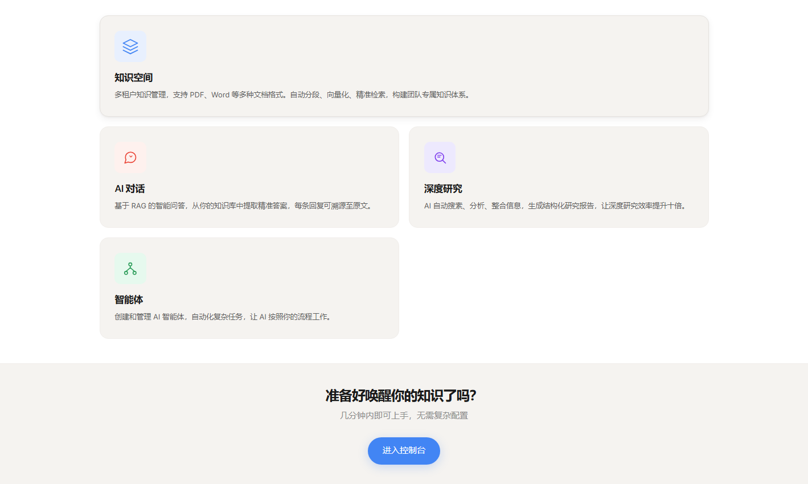
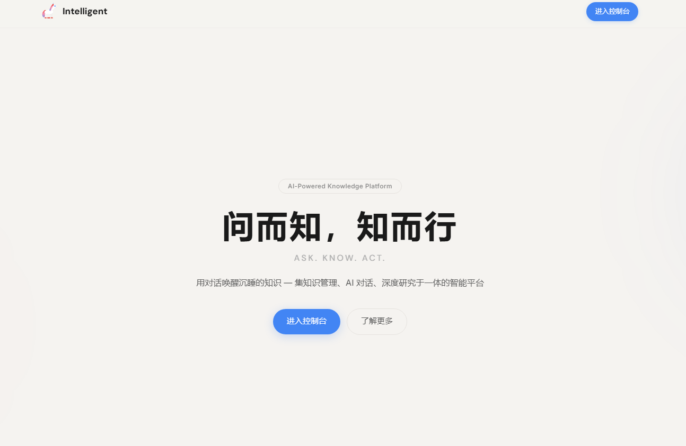

# NovaMind

[](./backend/pyproject.toml)
[](./frontend/package.json)
[](./frontend/package.json)
[](./LICENSE)

NovaMind 是一个开源的智能知识库管理系统。基于 FastAPI + Vue 3 构建，支持文档管理、向量检索、多模型智能问答、深度研究和知识库测评。

<p align="center">
  
</p>
<p align="center">
  
</p>

## 目录

- [核心特性](#核心特性)
- [技术栈](#技术栈)
- [快速开始](#快速开始)
  - [方式一：一键部署（推荐）](#方式一一键部署推荐)
  - [方式二：Docker 手动部署](#方式二docker-手动部署)
  - [方式三：本地开发](#方式三本地开发)
- [项目结构](#项目结构)
- [架构概览](#架构概览)
- [功能模块](#功能模块)
- [推荐模型](#推荐模型)
- [许可证](#许可证)

## 核心特性

- **多策略知识检索** — 向量检索 + BM25 文本检索 + 混合检索，支持 Rerank 重排序
- **多模型智能问答** — 支持 OpenAI 兼容接口，会话级模型切换，上下文压缩
- **深度研究** — 多源搜索（Tavily / SerpAPI / DuckDuckGo），自动生成研究报告
- **知识库测评** — 测试集管理、自动化批量测评、人工评分
- **Agent 智能体** — MCP Server 扩展、代码沙箱执行、多轮工具调用
- **技能广场** — 技能包上传/审核/安装、市场发现、Agent 能力扩展
- **应用中心** — AI 应用入口，已实现简历挖掘等场景化工具
- **DDD 架构** — 领域驱动设计，模块解耦，易于扩展

## 技术栈

| 类别 | 技术 |
|------|------|
| 后端框架 | FastAPI + Python 3.12 |
| 前端框架 | Vue 3 + TypeScript + Vite |
| 数据库 | MySQL 8.0 |
| 缓存 | Redis 7 |
| 搜索引擎 | Elasticsearch 8.15 |
| 对象存储 | MinIO |
| AI 模型 | OpenAI 兼容接口（通义千问、智谱 AI 等） |
| 认证 | JWT + Argon2 |

## 快速开始

### 方式一：一键部署（推荐）

```bash
# 1. 克隆项目
git clone git@github.com:SpaceshiptoMoon/NovaMind.git
cd NovaMind

# 2. 一键部署（自动创建配置、生成随机密码、启动服务）
bash deploy.sh
```

脚本会自动完成：
- 从模板创建 `.env`（自动生成随机密码）
- 创建 `docker.yaml`（Docker 环境配置）
- 创建 `default.yaml`（后端基础配置）
- 构建并启动所有 Docker 服务

> 部署完成后管理员密码在 `.env` 文件的 `ADMIN_PASSWORD` 中查看。

**环境要求：** Docker 20.10+、Docker Compose V2+、内存 >= 4GB

### 方式二：Docker 手动部署

如果需要自定义密码，可以手动配置：

```bash
# 1. 克隆项目
git clone git@github.com:SpaceshiptoMoon/NovaMind.git
cd NovaMind

# 2. 创建环境配置（所有密码在此文件集中管理）
cp .env.example .env
# 编辑 .env，填入自定义密码

# 3. 创建 Docker 配置
cp docker/configs/docker.example docker/configs/docker.yaml

# 4. 创建后端基础配置（非敏感配置已预设，敏感配置由 .env 覆盖）
cp backend/src/setting/yaml_config/yaml/default.example backend/src/setting/yaml_config/yaml/default.yaml

# 5. 启动所有服务（首次约 5-10 分钟）
docker compose up -d --build
```

**密码管理说明：**

所有密码集中在 `.env` 文件中，`docker-compose.yml` 和 `docker.yaml` 通过 `${VAR_NAME}` 引用，修改密码只需编辑 `.env` 一个文件。

| 变量 | 说明 |
|------|------|
| `MYSQL_ROOT_PASSWORD` | MySQL root 密码 |
| `MINIO_ROOT_USER` / `MINIO_ROOT_PASSWORD` | MinIO 凭据 |
| `ES_PASSWORD` | Elasticsearch 密码 |
| `SECRET_KEY` | JWT 签名密钥 |
| `ENCRYPTION_KEY` | AES-256 数据加密密钥 |
| `ADMIN_PASSWORD` | 管理员初始密码 |

### 方式三：本地开发

```bash
# 1. 创建后端配置
cd backend/src/setting/yaml_config/yaml/
cp default.example default.yaml
# 编辑 default.yaml，填入本地数据库密码、API Key 等

# 2. 启动后端
cd backend
python -m venv .venv
source .venv/bin/activate  # Windows: .venv\Scripts\activate
pip install .
mysql -u root -p -e "CREATE DATABASE IF NOT EXISTS novamind_db CHARACTER SET utf8mb4 COLLATE utf8mb4_unicode_ci;"
python main.py --config development --reload
```

后端运行在 http://localhost:8100

```bash
# 3. 启动前端
cd frontend
npm install
npm run dev
```

前端运行在 http://localhost:5173，API 请求自动代理到后端。

> 配置加载机制：`default.yaml` 为基础配置，启动时通过 `--config` 参数指定环境覆盖文件（如 `docker.yaml`），两者深度合并。

---

**访问地址：**

| 服务 | Docker 地址 | 本地开发地址 |
|------|-----------|-------------|
| 前端页面 | http://localhost | http://localhost:5173 |
| 后端 API 文档 | http://localhost/api/v1/docs | http://localhost:8100/docs |
| MinIO 控制台 | http://localhost:9001 | — |
| Elasticsearch | http://localhost:9200 | — |

**常用 Docker 命令：**

```bash
docker compose ps                    # 查看服务状态
docker compose logs -f app           # 查看应用日志
docker compose down                  # 停止（保留数据）
docker compose down -v               # 停止并清除数据卷
docker compose up -d --build app     # 仅重建应用容器
```

## 项目结构

```
novamind/
├── backend/                    # 后端 (FastAPI)
│   ├── src/
│   │   ├── core/              # 核心基础设施（认证、数据库、中间件）
│   │   ├── features/          # 业务模块（DDD 架构）
│   │   │   ├── user/          # 用户管理
│   │   │   ├── knowledge_space/ # 知识空间
│   │   │   ├── qa/            # 智能问答
│   │   │   ├── deep_research/ # 深度研究
│   │   │   ├── evaluation/    # 知识库测评
│   │   │   ├── agent/         # Agent 智能体
│   │   │   ├── skill/         # 技能广场
│   │   │   └── app/           # 应用中心
│   │   ├── shared/            # 跨模块共享组件
│   │   └── setting/           # 多环境配置管理
│   ├── main.py                # 后端入口
│   └── pyproject.toml
├── frontend/                   # 前端 (Vue 3)
│   ├── src/
│   │   ├── api/               # API 请求封装
│   │   ├── components/        # 公共组件
│   │   ├── views/             # 页面
│   │   ├── stores/            # Pinia 状态管理
│   │   └── router/            # 路由
│   └── package.json
├── docker/                     # Docker 部署配置
│   ├── Dockerfile             # 一体化构建（前端 + 后端 + Nginx）
│   ├── nginx.conf             # Nginx 配置
│   ├── supervisord.conf       # 进程管理配置
│   └── configs/
│       └── docker.example     # Docker 环境配置模板
├── docker-compose.yml          # 一键部署
├── deploy.sh                   # 一键部署脚本
├── .env.example                # 环境变量模板
└── README.md
```

## 架构概览

Docker 部署时，前端、后端和 Nginx 运行在同一个容器中，通过 supervisord 管理。Nginx 对外暴露 80 端口，同时提供前端静态文件服务和 API 反向代理。

```
Docker Compose
├── app 容器 (:80)
│   ├── Nginx (监听 80)
│   │   ├── /           → 前端静态文件
│   │   └── /api/*      → 反向代理 → FastAPI (:8100)
│   └── FastAPI (监听 8100，容器内部)
│       └── 配置: default.yaml + docker.yaml (.env 密码注入)
├── MySQL 8.0
├── Redis 7
├── MinIO
└── Elasticsearch 8.15
```

**配置架构：**

```
.env (所有密码，单一来源)
  ├── docker-compose.yml     ← ${VAR} 引用（基础设施密码）
  └── docker.yaml            ← ${VAR} 引用（后端配置密码）
       ↓ env_file: .env      ← 容器内环境变量注入
       ↓ YAML loader         ← ${VAR_NAME} 自动替换
```

后端采用 DDD 分层架构：

```
src/features/{module}/
├── api/            # 路由、依赖注入、异常处理
├── services/       # 业务逻辑层
├── repository/     # 数据访问层
├── models/         # SQLAlchemy ORM 模型
└── schemas/        # Pydantic 数据模型
```

## 功能模块

| 模块 | 路由前缀 | 说明 |
|------|---------|------|
| 用户管理 | `/api/v1/user` | JWT 认证、角色权限控制 |
| 知识空间 | `/api/v1/spaces` | 文档管理、向量检索、多策略搜索 |
| 智能问答 | `/api/v1/qa` | 多模型对话、会话管理 |
| AI 聊天 | `/api/v1/ai-chat` | 实时流式 AI 对话 |
| 深度研究 | `/api/v1/spaces/{id}/deep-research` | 多源搜索、研究报告生成 |
| 知识库测评 | `/api/v1/spaces/{id}/knowledge-bases/{kb_id}/evaluation` | 测试集管理、自动化测评 |
| Agent 智能体 | `/api/v1/agent` | MCP Server 扩展、代码沙箱 |
| 技能广场 | `/api/v1/skills` | 技能上传、审核、安装、市场浏览 |
| 应用中心 | `/api/v1/apps` | 简历挖掘等 AI 应用 |

## 推荐模型

NovaMind 对模型没有强绑定，只要实现了 OpenAI 兼容 API 的模型都可以接入。以下能力更强的模型效果更好：

- **长上下文窗口**（100k+ tokens），适合深度研究和多步骤问答
- **稳定的 tool use 能力**，适合 Agent 工具调用和结构化输出
- **中文理解能力**，适合中文知识库场景

已在以下模型上验证：

| Provider | 模型 | 用途 |
|----------|------|------|
| 阿里云 | qwen3.5-plus | LLM 问答 |
| 阿里云 | text-embedding-v2/v3 | 文本向量化 |
| 阿里云 | qwen3-vl-rerank | 检索重排序 |
| 智谱 AI | glm-4 | LLM 问答 |

## 许可证

本项目采用 [MIT License](./LICENSE) 开源发布。
