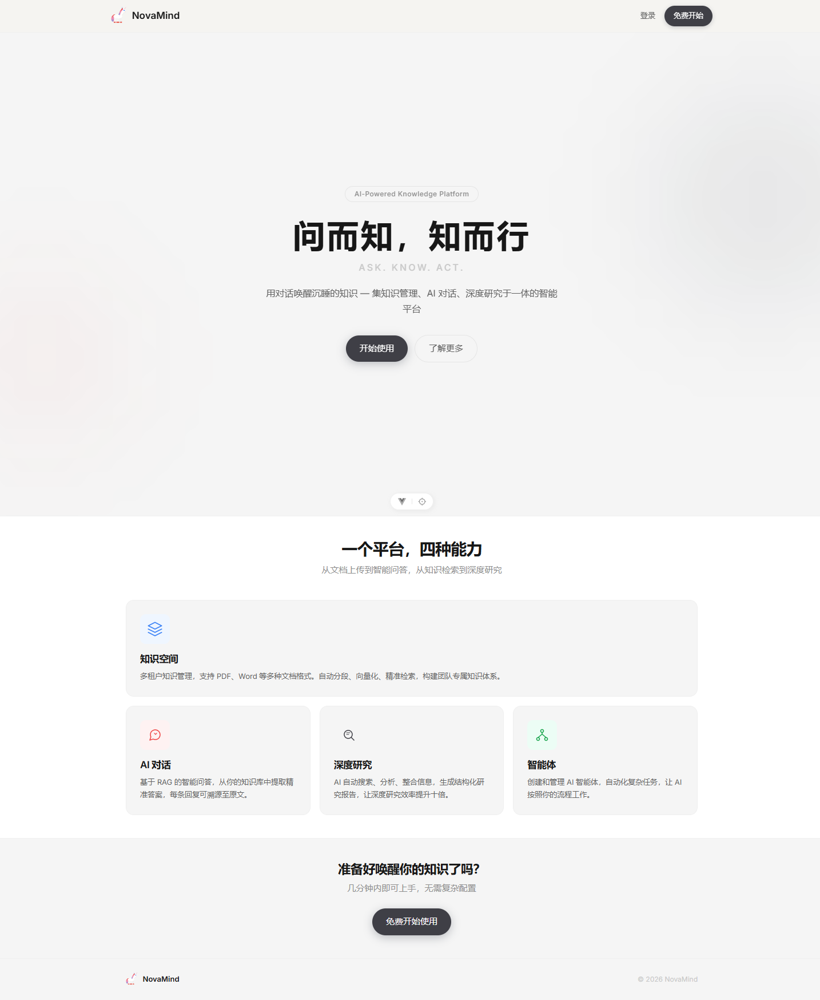
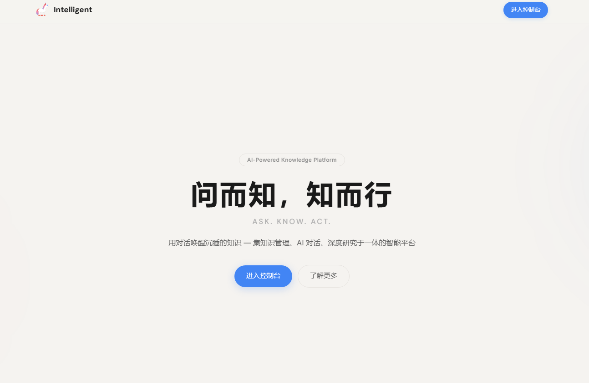

<div align="center">

# 🧠 NovaMind

**一站式智能知识平台：知识库 · 多模态解析 · RAG 问答 · 深度研究 · Agent**

[](./LICENSE)
[](https://github.com/SpaceshiptoMoon/NovaMind/actions/workflows/ci.yml)
[](./backend/pyproject.toml)
[](./backend)
[](./frontend)
[](./frontend)
[](./docker-compose.yml)
[](https://deepwiki.com)

[English](./README.en.md) | 简体中文

</div>

NovaMind 是一个面向团队与个人的智能知识平台，围绕**知识库构建、多模态文档解析、检索增强问答、深度研究、Agent 工具调用、技能扩展和效果评测**提供一体化能力。项目采用 `FastAPI + Vue 3` 构建，支持 Docker 一键部署，也支持前后端分离的本地开发模式。

<p align="center">
  
</p>
<p align="center">
  
</p>

<details open>
<summary><b>📕 目录</b></summary>

- [项目定位](#项目定位)
- [核心能力](#核心能力)
- [文档处理管道](#文档处理管道)
- [知识库 Wiki](#知识库-wiki)
- [适合什么场景](#适合什么场景)
- [技术栈](#技术栈)
- [快速开始](#快速开始)
  - [方式一：一键部署](#方式一一键部署)
  - [方式二：手动 Docker 部署](#方式二手动-docker-部署)
  - [方式三：本地开发](#方式三本地开发)
- [访问入口](#访问入口)
- [架构概览](#架构概览)
- [仓库结构](#仓库结构)
- [主要模块](#主要模块)
- [配置说明](#配置说明)
- [模型接入建议](#模型接入建议)
- [安全特性](#安全特性)
- [测试与质量检查](#测试与质量检查)
- [常见问题 FAQ](#常见问题-faq)
- [项目状态](#项目状态)
- [文档导航](#文档导航)
- [开源协作](#开源协作)
- [许可证](#许可证)

</details>

---

## 项目定位

很多知识库项目只覆盖“上传文档并问答”这一段链路。NovaMind 试图覆盖更完整的工作流：

- 从空间、知识库、文档上传到**多模态解析**（文本 / 图片 / 视频 / 音频）、切分、向量化、索引
- 从检索到 RAG 问答，再到深度研究报告生成
- 从普通聊天到带工具调用、MCP 扩展和技能市场的 Agent
- 从能力搭建到测试集评测、人工复核和结果导出
- 从原始文档到自动生成的结构化 Wiki、知识图谱与质量巡检

如果你希望搭建的不只是一个聊天窗口，而是一套可组织知识、执行任务、评估效果的系统，NovaMind 更接近完整工作台。

## 核心能力

### 📚 知识库引擎

- **知识空间与知识库管理**：多空间隔离、成员协作（OWNER / ADMIN / EDITOR / VIEWER 分层权限）、知识库级解析配置和文档全生命周期管理
- **混合检索**：向量检索、BM25 全文、混合检索、Rerank 重排、查询改写与多级降级策略，9 种检索模式
- **假设问题增强**：可为分块自动生成假设问题并建立问题向量，提升问答召回
- **知识库评测**：测试集管理、自动评测、人工打分、报告导出，验证知识库真实效果

### 📄 多模态文档解析

- **文本文档**：PDF（DeepDoc 逐框文字层 + OCR 融合的 full 模式 / 轻量 plain 模式）、DOCX、TXT、MD、CSV、HTML、JSON
- **图片理解**：VLM 生成图片描述，或 DeepDoc OCR 提取图内文字
- **视频解析**：按固定间隔 / 场景切换 / 去重抽帧，逐帧（或分组）VLM 描述，双锚点时间轴对齐
- **音频转写**：默认本地 **faster-whisper**（免费、无需 API Key、部署期预装模型），也可切换已配置的云端 ASR（OpenAI Whisper / DashScope Paraformer）
- **公式与表格**：PDF 公式识别（pix2text-mfr INT8）、表格结构还原与 HTML 内联
- **断点续跑**：解析 → 切分 → 向量化三级内容指纹，重试时指纹匹配即复用已付费的解析产物，配置变更自动级联失效

### 🤖 智能应用

- **RAG 问答**：基于知识库的多轮问答，支持会话配置与上下文压缩，答案带引用溯源
- **深度研究**：联合内部知识库与外部搜索（数据源可插拔：Tavily / SerpAPI / DuckDuckGo），分步骤生成研究报告
- **Agent**：工具调用、MCP Server 接入、执行轨迹回放
- **技能广场**：技能上传、审核、安装与市场化分发
- **应用中心**：面向具体业务场景封装 AI 能力（如简历挖掘）

### 🕸 知识库 Wiki

基于知识库内容自动生成结构化 Wiki（对齐 WeKnora 设计）：

- 自动生成索引页 / 主题页 / 摘要页，条目间自动建立 `[[链接]]` 并生成**知识图谱**（可交互浏览）
- 生成结果同步写入 ES 检索索引并参与加权排序，问答可直接命中 Wiki 条目
- 文档更新 / 删除时自动对账（reparse 合并更新、来源删除 retract 回收）
- **质量巡检**：孤儿页 / 死链 / 失效引用 / 空内容等六类问题检查，健康分 0-100 评分，支持一键自动修复

### 🛡 平台能力

- **任务系统**：基于 ARQ 的异步任务编排——批量处理、进度节点可视化、取消 / 重试、僵尸任务清理、崩溃后孤儿恢复
- **实时通知**：WebSocket 推送 + 轮询兜底，解析完成 / 失败 / 取消即时触达
- **多模型接入**：LLM / Embedding / Rerank / VLM / ASR 五类模型，OpenAI 兼容协议即插即用，连接测试与密钥加密存储

## 文档处理管道

所有文档经统一管道处理，四个模态分支共享后置尾（切分 → 向量化 → 假设问题 → ES 索引）：

```text
上传（MinIO 原件 + 哈希去重）
  └▶ arq 异步任务
       ├─ 文本分支   DeepDoc 解析 / 通用 Reader ─┐
       ├─ 图片分支   VLM 描述 / OCR ──────────────┤
       ├─ 视频分支   抽帧 → VLM 逐帧描述 ─────────┼─▶ 统一切分 → Embedding
       └─ 音频分支   本地 faster-whisper / 云端 ASR ┘   → 假设问题（可选）
                                                       → ES 向量+全文索引
                                                       → Wiki 生成（KB 开启时）
```

管道可靠性设计：

- **三级内容指纹**（parse / split / embed）：重试时指纹匹配即复用快照，跳过昂贵的 VLM / OCR / ASR / Embedding 调用；解析或切分配置变更自动级联失效下游
- **节点级进度**：每个步骤（parsed / split / embedded / indexed…）实时落库，任务列表可视化执行轨迹，失败定位到具体节点
- **事务安全**：DB 写走 SAVEPOINT，队列任务与任务行原子绑定，进程崩溃后启动期自动恢复孤儿任务
- **全文留存**：解析全文即时落 MinIO，切块 / 向量化失败也不丢解析结果

## 知识库 Wiki

传统知识库回答“这段内容在哪”，Wiki 回答“这个主题的全貌是什么”。NovaMind 的 Wiki 子系统：

```text
知识库文档 ──解析完成──▶ Wiki 生成任务（LLM 规划 + 生成）
                            ├─ index 页：全局导航
                            ├─ topic 页：主题聚合（多来源合并）
                            └─ summary 页：单文档摘要
                                 │
                                 ├─▶ [[链接]] 自动解析 + 知识图谱构建
                                 ├─▶ ES 同步（wp-* chunk，检索加权 1.3x）
                                 └─▶ 质量巡检（六类 lint + 健康分）
```

- **前端可视化**：Wiki 浏览器（页面渲染 + 反向链接）、力导向图谱（主题联动、节点高亮）、问题面板（逐条修复 / 忽略）
- **Agent 联动**：问答 Agent 可将 Wiki 页面作为工具读取，实现“先查全貌再钻细节”
- **生命周期管理**：文档重新解析时旧生成任务自动取消、新结果合并更新；文档删除时页面自动回收，不留悬空引用

## 适合什么场景

- 团队或组织内部知识库，需要多空间隔离和成员权限管理
- 文档形态多样：扫描件 PDF、图片、会议录音、教学视频都需要进同一个检索体系
- 需要完整的文档处理链路：上传 → 解析 → 切分 → 向量化 → 检索 → 问答，且每一步可观测、可恢复
- 需要把 RAG 问答、深度研究、Agent 工具调用串成一条工作流，而不是零散的工具拼凑
- 需要评测体系（测试集、自动评测、人工打分）来验证知识库效果
- 愿意投入一些基础设施成本（MySQL、Redis、Elasticsearch、MinIO）来换取能力的完整性和自由度

## 技术栈

| 类别 | 技术 |
| --- | --- |
| 后端 | FastAPI, Python 3.12, SQLAlchemy, Pydantic |
| 前端 | Vue 3, TypeScript, Vite, Pinia, Vue Router, Element Plus, ECharts |
| 数据存储 | MySQL 8.4 |
| 缓存 / 队列 | Redis 7, ARQ（异步任务） |
| 检索引擎 | Elasticsearch 9.3（向量 + BM25 混合检索） |
| 对象存储 | MinIO |
| 文档解析 | DeepDoc（OCR / 版面分析 / 表格还原 / 公式识别）、pypdf、python-docx 等 |
| 多模态模型 | VLM（图片 / 视频帧理解）、faster-whisper（本地 ASR）、云端 ASR |
| 扩展协议 | MCP（Model Context Protocol） |
| 部署 | Docker Compose, Nginx, Supervisord |

## 快速开始

> [!IMPORTANT]
> **所有部署方式通用前置条件**：
>
> - **Linux 自托管必须设置 `vm.max_map_count`**：Elasticsearch 要求内核 `vm.max_map_count >= 262144`，多数 Linux 发行版默认 65530，会导致 ES 容器启动即退出（日志报 `max virtual memory areas vm.max_map_count [...] is too low`）。三种方式（一键/手动/本地开发）只要用 Docker 起 Elasticsearch 都受影响。
>   ```bash
>   sudo sysctl -w vm.max_map_count=262144              # 临时生效（重启失效）
>   echo 'vm.max_map_count=262144' | sudo tee -a /etc/sysctl.conf  # 永久生效
>   ```
>   Docker Desktop（macOS / Windows）在其 Linux VM 内已自动处理，无需此步。
> - **克隆仓库建议用 HTTPS 地址**（无需配置 SSH key）：`git clone https://github.com/SpaceshiptoMoon/NovaMind.git`；已配置 SSH key 的用户可用 `git clone git@github.com:SpaceshiptoMoon/NovaMind.git`。

### 方式一：一键部署

推荐第一次体验时使用。

```bash
# Linux / macOS / Git Bash
bash deploy.sh

# Windows PowerShell（默认执行策略 Restricted 会拒绝运行脚本，用这条命令）
powershell -ExecutionPolicy Bypass -File deploy.ps1
```

部署脚本会自动完成：

- 检查 Docker 和 Docker Compose 环境
- 从 `.env.example` 生成 `.env`
- 生成随机密码、密钥和管理员初始密码
- 创建 `docker/configs/docker.yaml`
- 创建 `backend/src/setting/yaml_config/yaml/default.yaml`
- 构建并启动完整服务栈
- **部署期下载 DeepDoc 模型**（OCR / 版面 / 表格 / 段落合并 XGBoost / 公式识别 pix2text-mfr，共数百 MB）到 `backend/.cache/deepdoc`，经 compose 卷挂载进容器（`/app/.cache/deepdoc`），容器重建不丢；下载源默认国内镜像 `hf-mirror.com`（`HF_ENDPOINT` 可覆盖）。**此步失败不会中断部署**，仅解析能力降级（公式识别跳过、DeepDoc full 模式不可用），可事后按脚本提示重试
- **部署期下载本地语音模型**（faster-whisper-tiny，约 75MB）到 `backend/.cache/faster-whisper`（挂载为 `/app/.cache/faster-whisper`）——音频文档默认走本地转写，模型缺失时音频解析会失败，可按脚本提示重试
- 轮询 `http://localhost/health` 做健康检查

部署完成后，管理员初始密码可在根目录 `.env` 的 `ADMIN_PASSWORD` 中查看，**默认用户名为 `admin`**。

环境要求：

- Docker 20.10+（Windows 需 Docker Desktop 已启动）
- Docker Compose V2+
- 一键部署（`deploy.sh`）需要宿主机有可用的 `python` 命令（用于生成随机密码；脚本会自动探测，不可用时给出替代方案）。`deploy.ps1` 无此依赖
- 最低 2 核 CPU / 4 GB 内存 / 20 GB 磁盘（Elasticsearch 默认占 512MB JVM 堆，可在 `.env` 的 `ES_JAVA_OPTS` 调整；构建期 `--build` 峰值内存更高，低内存机器建议先关闭其他大内存应用）
- 如需使用视频解析、本地语音转写或 DeepDoc full 模式，建议 4 核 / 8 GB 以上

常用命令：

```bash
bash deploy.sh status
bash deploy.sh logs
bash deploy.sh update
bash deploy.sh stop
bash deploy.sh clean   # ⚠️ 会删除全部数据卷（知识库、文档、用户数据全部丢失），脚本内有交互确认
```

```powershell
.\deploy.ps1 status
.\deploy.ps1 logs
.\deploy.ps1 update
.\deploy.ps1 stop
.\deploy.ps1 clean   # ⚠️ 同上，删除全部数据卷
```

### 方式二：手动 Docker 部署

如果你希望手动控制配置文件和密码：

```bash
git clone https://github.com/SpaceshiptoMoon/NovaMind.git
cd NovaMind

cp .env.example .env
cp docker/configs/docker.example docker/configs/docker.yaml
cp backend/src/setting/yaml_config/yaml/default.example backend/src/setting/yaml_config/yaml/default.yaml

docker compose up -d --build
```

> [!WARNING]
> **`cp .env.example .env` 后必须编辑 `.env`，替换全部 `your-*` 占位符再启动**，否则：
>
> - `ADMIN_PASSWORD` 占位值不含大写字母/数字/特殊字符，首次启动能成功（初始密码弱），但**第二次重启会因后端密码强度校验失败陷入容器崩溃循环**——管理员密码要求：8-30 位，必须同时包含大写字母、小写字母、数字、特殊字符
> - `SECRET_KEY` / `ENCRYPTION_KEY` 占位值是公开仓库里的已知值，不改则 JWT 可被伪造、已加密的模型 API Key 可被解密
>
> 需要替换的变量：`MYSQL_ROOT_PASSWORD`、`MINIO_ROOT_USER`、`MINIO_ROOT_PASSWORD`、`ES_PASSWORD`、`SECRET_KEY`、`ENCRYPTION_KEY`、`ADMIN_PASSWORD`。

说明：

- `.env` 管理基础设施密码和后端密钥
- `docker/configs/docker.yaml` 是 Docker 运行时挂载配置
- `default.yaml` 负责后端基础配置，同样以只读方式挂载进容器；`*.yaml` 不打进镜像，防止本地真实密钥泄漏进镜像层，敏感值通常由环境变量覆盖
- 方式二跳过了部署脚本的模型下载步骤，首次启动后两类模型缺失：
  - **DeepDoc 模型缺失**：解析能力降级（公式识别跳过、full 模式不可用，`/health/detailed` 显示 degraded）。手动补齐：
    ```bash
    docker compose run --rm --no-deps --user 0 \
      -e PYTHONPATH=/app/src -e HF_ENDPOINT=https://hf-mirror.com \
      app python -m novamind.engines.document.integrations.deepdoc prepare --include-text-concat --include-formula
    ```
  - **本地语音模型缺失**：音频解析（未显式选云端 ASR 时）会失败。手动补齐：
    ```bash
    docker compose run --rm --no-deps --user 0 \
      -e PYTHONPATH=/app/src -e HF_ENDPOINT=https://hf-mirror.com \
      -e NOVAMIND_LOCAL_WHISPER_MODEL_DIR=/app/.cache/faster-whisper/tiny \
      app python scripts/download_faster_whisper_model.py
    ```

### 方式三：本地开发

适合前后端联调或二次开发。

1. 准备配置文件（`.env` 和 YAML 模板都要）

```bash
# 在仓库根目录执行
cp .env.example .env                      # 必需：compose 和后端都要读它，缺了基础设施起不来

cd backend/src/setting/yaml_config/yaml
cp default.example default.yaml
cp development.example development.yaml
cd -                                      # 回到仓库根目录
```

2. 启动基础设施

   本地开发需要以下服务在 `localhost` 上运行：

   | 服务 | 用途 | 默认端口 |
   | --- | --- | --- |
   | **MySQL 8.4** | 业务数据持久化 | 3306 |
   | **Redis 7** | 缓存和异步任务队列 | 6379 |
   | **MinIO** | 文档原件和解析结果的对象存储 | 9005 |
   | **Elasticsearch 9.3** | 向量检索 + BM25 全文检索 | 9200 |

   推荐用 Docker Compose 启动基础设施（不构建应用容器）：

   ```bash
   docker compose up -d mysql redis minio elasticsearch
   ```

   如果你本地已安装这些服务，确保它们的连接信息与 YAML 配置一致即可。

3. 启动后端

```bash
cd backend
uv sync           # 安装依赖（需先安装 uv：pip install uv 或 curl -LsSf https://astral.sh/uv/install.sh | sh）
uv run python main.py --config development --reload
```

> **配置说明**：后端所有配置从 YAML 文件读取（`backend/src/setting/yaml_config/yaml/`），YAML 中 `${VAR_NAME}` 占位符由运行时环境变量解析。
> 后端启动时自动加载仓库根 `.env`（进程环境变量优先），因此占位符直接从 `.env` 取值，无需手动 export。参考下文[配置说明](#配置说明)。

默认后端地址：`http://localhost:8100`

> [!NOTE]
> **本地开发使用音频 / 视频解析**：本地语音模型默认从 `~/.cache/faster-whisper/tiny` 加载，首次使用前手动下载：
> ```bash
> cd backend
> uv run python scripts/download_faster_whisper_model.py
> ```
> DeepDoc 视觉模型（PDF full 模式 / 公式识别）同理：
> ```bash
> uv run python scripts/download_deepdoc_models.py
> ```

4. 启动前端

```bash
cd frontend
npm install
npm run dev
```

默认前端地址：`http://localhost:5173`

## 访问入口

Docker 部署模式：

| 服务 | 地址 | 凭据 |
| --- | --- | --- |
| 前端首页 | `http://localhost` | 管理员账号 `admin`，初始密码见 `.env` 的 `ADMIN_PASSWORD` |
| 后端 API 文档 | `http://localhost/docs` | 同上 |
| 健康检查 | `http://localhost/health` | 无（进程存活检查，不校验依赖；依赖健康看 `/health/detailed`） |
| MinIO 控制台 | `http://localhost:9001` | `.env` 的 `MINIO_ROOT_USER` / `MINIO_ROOT_PASSWORD` |
| Elasticsearch | `http://localhost:9200` | 无（Docker 部署关闭了 ES 安全特性） |

本地开发模式：

| 服务 | 地址 |
| --- | --- |
| 前端开发服务器 | `http://localhost:5173` |
| 后端 API 文档 | `http://localhost:8100/docs` |
| 后端健康检查 | `http://localhost:8100/health` |

## 架构概览

默认 Docker 形态为“单应用容器 + 多基础设施容器”：

- `app` 容器内运行 `Nginx + 前端静态资源 + FastAPI + 嵌入式 ARQ Worker`
- `mysql`、`redis`、`minio`、`elasticsearch` 以独立服务编排，基础设施端口绑定到 `127.0.0.1`，不对公网暴露
- `Nginx` 对外暴露 `80` 端口，按路径分发到静态资源或 FastAPI
- FastAPI 在容器内部监听 `8100`，仅 Nginx 可达

```text
Browser
  │  :80
  ▼
┌──────────────────────────────────────────────────────┐
│ app 容器（单容器）                                      │
│   Nginx ── /         ─▶ Vue 静态资源                    │
│        ── /api/*     ─▶ FastAPI (:8100)                │
│        ── /health    ─▶ FastAPI health endpoint         │
│   FastAPI + 嵌入式 ARQ Worker（同进程异步任务）           │
└──────┬───────────────────────────────────────────────┘
       │  仅 Nginx 对外暴露 80；FastAPI 仅容器内可达
       │
       ├──▶ MySQL 8.4         ORM 持久化：用户 / 空间 / 知识库 / 文档任务 / Wiki 页面
       ├──▶ Redis 7           缓存 / ARQ 异步任务队列 / 任务追踪与取消标记 / JWT 黑名单
       ├──▶ MinIO             文档原件、解析全文、视频帧、Wiki 快照对象存储
       └──▶ Elasticsearch 9.3 向量召回 + BM25 全文混合检索索引（含 Wiki 条目）
```

后端采用按领域拆分的目录结构，`features/` 为业务模块、`engines/` 为可复用引擎、`shared/` 为跨模块基础设施：

```text
src/features/{module}/           业务模块（领域层）
|- api/                          路由层（薄，注册于 router_manager）
|- services/                     业务编排
|- repository/                   数据访问（写操作走 SAVEPOINT）
|- models/                       ORM 模型
`- schemas/                      Pydantic 请求/响应模型

src/engines/{engine}/            可复用引擎（document/rag/agent/eval/search/…）
src/shared/                      模型客户端工厂 / 存储 / MQ / Prompt 注册表
src/core/                        应用工厂 / 中间件 / 认证 / 生命周期
```

## 仓库结构

```text
NovaMind/
|- backend/                         # FastAPI 后端
|  |- main.py
|  |- pyproject.toml
|  |- scripts/                      # 模型下载脚本（DeepDoc / faster-whisper）
|  |- src/
|  |  |- core/                     # 应用工厂、中间件、生命周期、安全
|  |  |- engines/                  # 引擎层：document / rag / agent / eval / search / deep_research / resume
|  |  |- features/                 # 领域模块（user / knowledge_space / qa / agent / …）
|  |  |- setting/                  # YAML 配置加载
|  |  `- shared/                   # 共享基础设施（storage/ai_models/mq/document/…）
|  `- tests/                       # 按被测对象分层（architecture/core/shared/engines/features）
|- frontend/                       # Vue 3 + TypeScript 前端
|  |- src/
|  |  |- api/                      # 按领域分组的类型化 API 客户端
|  |  |- components/               # 领域组件（knowledge/agent/chat/…）
|  |  |- router/
|  |  |- stores/                   # Pinia
|  |  `- views/                    # 路由级页面（space/agent/research/skill/…）
|- docker/                         # Dockerfile、Nginx、Supervisord、配置模板
|- docs/                           # 设计文档与导航文档
|- docker-compose.yml
|- deploy.ps1
|- deploy.sh
`- README.md
```

## 主要模块

| 模块 | 路由前缀 | 说明 |
| --- | --- | --- |
| 用户与模型配置 | `/api/v1/user` | 认证、用户管理、五类模型配置与连接测试 |
| 知识空间 | `/api/v1/spaces` | 空间管理、成员管理、权限隔离 |
| 知识库管理 | `/api/v1/spaces/{space_id}/knowledge-bases` | 知识库创建、配置、文档管理 |
| 知识检索 | `/api/v1/spaces/{space_id}/knowledge-bases/{kb_id}/search` | 搜索模式、检索、Rerank |
| 知识库 Wiki | `/api/v1/spaces/{space_id}/knowledge-bases/{kb_id}/wiki` | Wiki 生成 / 浏览 / 图谱 / 质量巡检 |
| 智能问答 | `/api/v1/qa` | 基于知识库的多轮问答 |
| AI 聊天 | `/api/v1/ai-chat` | 流式对话和附件交互 |
| 深度研究 | `/api/v1/spaces/{space_id}/deep-research` | 多源搜索和研究报告 |
| 知识库评测 | `/api/v1/spaces/{space_id}/knowledge-bases/{kb_id}/evaluation` | 测试集、评测任务、导出 |
| Agent | `/api/v1/agent` | Agent、MCP Server、工具调用 |
| 技能广场 | `/api/v1/skills` | 技能上传、审核、安装、浏览 |
| 应用中心 | `/api/v1/apps` | 场景化 AI 应用 |
| 通知中心 | `/api/v1/notifications` | 站内通知和偏好设置 |

## 配置说明

配置系统分两层：**YAML 文件**（结构与环境差异）和 **`.env` 文件**（唯一密钥源）。

### YAML 配置（实际生效）

后端在启动时从 `backend/src/setting/yaml_config/yaml/` 读取 YAML 文件作为配置来源：

| 文件 | 用途 |
| --- | --- |
| `default.yaml` | 基础配置，所有环境共享（Docker 部署时挂载进容器） |
| `development.yaml` | 开发环境覆盖（`--config development`） |
| `production.yaml` | 生产环境覆盖（`--config production`） |
| `docker.yaml` | Docker 运行时附加配置（挂载自 `docker/configs/docker.yaml`） |

加载逻辑：

- `default.yaml` 作为基线 → 加载指定环境的 YAML 做深度合并
- 还存在可选的第三层 **`local.yaml`**（与 default.yaml 同目录）：在环境合并之后再合并一次，
  适合不改任何模板文件、只在本地覆盖个别配置（如调试用的模型地址）；默认不存在则跳过
- YAML 中 `${VAR_NAME}` 形式的占位符，由 **操作系统环境变量** 在运行时解析（`os.getenv`）
- 后端启动时 **自动加载仓库根 `.env`**（进程环境变量优先，`.env` 不会覆盖已 export 的变量），
  因此本地开发时 YAML 占位符直接从 `.env` 取值，无需手动 export

### `.env`（唯一密钥源）

根目录 `.env` 有两个消费方：

1. `docker compose`：插值容器环境变量（`${MYSQL_ROOT_PASSWORD}` 等）并通过 `env_file: .env` 注入 `app` 容器
2. 后端 `ConfigLoader`：本地开发时启动自动加载，解析 YAML 中的 `${VAR_NAME}` 占位符

| 变量 | 说明 | 消费方 |
| --- | --- | --- |
| `MYSQL_ROOT_PASSWORD` | MySQL root 密码 | `mysql` 容器 + YAML `database.password` |
| `MYSQL_DATABASE` | 默认数据库名 | `mysql` 容器 + `docker.yaml` `database.database`。注意：本地开发的 `default.yaml` 中数据库名是硬编码 `novamind_db`，不走此变量——本地开发时保持默认库名即可 |
| `MINIO_ROOT_USER` | MinIO 访问账号 | `minio` 容器 + YAML `minio.access_key` |
| `MINIO_ROOT_PASSWORD` | MinIO 访问密码 | `minio` 容器 + YAML `minio.secret_key` |
| `ES_JAVA_OPTS` | Elasticsearch JVM 参数 | `elasticsearch` 容器 |
| `ES_PASSWORD` | Elasticsearch 密码（本地开发 YAML 消费；Docker 部署关闭了 ES 安全特性，实际不做鉴权） | `default.yaml` `elasticsearch.password` |
| `SECRET_KEY` | JWT 签名密钥 | YAML `security.secret_key` |
| `ENCRYPTION_KEY` | 加密密钥 | YAML `security.encryption_key` |
| `ADMIN_PASSWORD` | 管理员初始密码 | YAML `admin.password` |
| `HF_ENDPOINT` | 模型下载主源（默认 hf-mirror.com，海外可切官方源） | DeepDoc / faster-whisper 模型下载 |
| `DEEPDOC_MIRRORS` | DeepDoc 模型降级源清单（可选，JSON 数组，主源失败后按序换源，格式见 `.env.example`） | 模型下载降级 |
| `DEEPDOC_DISABLE_MIRRORS` | 置 `1` 禁用降级换源 | 模型下载降级 |

### 本地开发如何配

本地开发时（无 Docker），配置流程：

1. 从模板复制 YAML 文件与 `.env`（首次仅需一次）：
   ```bash
   cp .env.example .env                      # 仓库根，填入实际密钥
   cd backend/src/setting/yaml_config/yaml
   cp default.example default.yaml
   cp development.example development.yaml
   ```

2. 编辑 `.env`，将数据库、MinIO、Elasticsearch 等密码填入实际值（至少替换全部 `your-*` 占位符）。
   模板 YAML 中的敏感字段已全部是 `${VAR_NAME}` 占位符，后端启动时自动从 `.env`
   取值，无需再改 YAML。仍可直接把值写进 YAML（会覆盖占位符），或启动前
   `export VAR_NAME=value`（优先级最高：进程环境变量 > `.env` 文件）。

3. 如果使用 Docker Compose 启动基础设施（`docker compose up -d mysql redis minio elasticsearch`），
   容器内服务与 `.env` 密码自动保持一致——`.env` 是唯一密钥源，改密码只改这一处。

## 模型接入建议

NovaMind 对模型供应方没有强绑定，只要实现 OpenAI 兼容接口，就可以接入大部分能力链路。在「模型管理」页面添加配置后即可在全部功能中选用，支持连接测试。

建议按用途准备以下模型：

| 模型类型 | 用途 | 必需性 |
| --- | --- | --- |
| **LLM** | 问答、Agent 对话、Wiki 生成、研究总结 | 必需 |
| **Embedding** | 文档向量化和召回（dimension 自动回填空间配置） | 必需 |
| **Rerank** | 检索结果重排，提高召回质量 | 推荐 |
| **VLM** | 图片描述、视频逐帧理解 | 按需（图片 / 视频模态必需） |
| **ASR** | 音频转写 | 可不配（默认走本地 faster-whisper） |

<details>
<summary><b>关于本地语音转写（ASR）</b></summary>

音频文档的 ASR 模型有两条路径，可在知识库解析配置的音频分节中选择：

- **本地 Whisper（默认，免费）**：基于 faster-whisper 的本地 CPU 推理（INT8 量化，专用单进程隔离，不阻塞其它任务），模型 `faster-whisper-tiny` 在部署期自动预装，无需任何 API Key。适合对隐私敏感或不希望产生调用费用的场景；中文效果可用，追求更高准确率可自行换用 `small` / `base` 等更大的本地模型（下载后把路径填入 `knowledge_base.parsing.local_whisper_model_dir`）
- **云端 ASR（可选）**：使用「模型管理」中配置的 OpenAI Whisper 或 DashScope Paraformer，效果通常更好但按量计费；选择云端模型前请先通过连接测试确认凭证可用

</details>

如果你的场景偏中文、多工具调用或长上下文任务，优先选择在这些维度表现稳定的模型。

## 安全特性

- **密钥不落盘**：所有模型 API Key 经 `ENCRYPTION_KEY` 加密存储，配置文件只含 `${VAR}` 占位符；`*.yaml` 与 `.env` 均不进 Git
- **认证与鉴权**：JWT + Redis 黑名单双重管理，登出 / 禁用 / 删除用户即时吊销全部令牌；空间级四层角色权限 + 知识库级细粒度操作校验
- **上传防护**：文件类型双重校验（python-magic 魔数检测 + 内置签名表兜底，探测失败拒绝而非放行）；防路径遍历的文件名校验；上传大小按模态分治
- **注入防护**：全量 SQLAlchemy ORM 参数化查询；Pydantic 全量请求校验；模板化 Prompt 注册表管理
- **密码策略**：异步哈希（不阻塞事件循环），管理员密码强度校验（8-30 位四类字符）

## 测试与质量检查

后端测试按被测对象分层（`architecture / core / shared / engines / features / integration`），其中 `architecture` 层含结构门禁：**模块 import 图无环检查（Tarjan SCC）** 与**跨模块私有成员引用检查**，从机器层面防止架构退化。

后端（在 `backend/` 目录下，依赖已通过 `uv sync` 安装时）：

```bash
uv run pytest
uv run pytest -m unit
uv run pytest -m "not slow"
uv run pytest tests/architecture        # 只跑结构门禁
uv run pytest tests/features/knowledge_space   # 只跑某个领域
```

前端：

```bash
cd frontend
npm run type-check
npm run test:unit -- --run   # 加 --run 跑完退出；不加会进入 vitest watch 模式
npm run lint
npm run format
```

## 常见问题 FAQ

<details>
<summary><b>Elasticsearch 启动即退出，日志报 vm.max_map_count 太低？</b></summary>

见[快速开始](#快速开始)顶部的通用前置条件——设置 `vm.max_map_count >= 262144` 后重启 ES 容器。
</details>

<details>
<summary><b>管理员密码是多少？</b></summary>

Docker 一键部署后，用户名 `admin`，初始密码在根目录 `.env` 的 `ADMIN_PASSWORD` 中。首次登录后建议立即修改。
</details>

<details>
<summary><b>PDF 解析出 0 字符 / 提示建议切换 full 模式？</b></summary>

`plain` / `default` 模式只抽取 PDF 文字层，扫描件和图片型 PDF 文字层为空。在知识库解析配置中把 PDF 解析器切到 **full 模式**（逐框文字层 + OCR 融合）。full 模式依赖 DeepDoc 视觉模型，确认部署期模型下载成功（`/health/detailed` 可查）。
</details>

<details>
<summary><b>音频文档解析失败，提示本地模型未找到？</b></summary>

本地语音模型（faster-whisper-tiny）在部署期下载，若该步失败或采用手动部署方式跳过了下载，按[方式二](#方式二手动-docker-部署)中的命令补齐；本地开发则运行 `uv run python scripts/download_faster_whisper_model.py`。也可以在知识库配置中改用已配置的云端 ASR 模型。
</details>

<details>
<summary><b>模型该配在哪？和知识库配置什么关系？</b></summary>

两层：「模型管理」页配置模型本身（供应商 / API Key / base_url / dimension），是用户级资源；知识库 / 空间配置只**引用**模型名（如空间的 embedding 模型、知识库解析配置里的 VLM / ASR 模型）。模型管理里没有的模型不会出现在功能下拉中。
</details>

<details>
<summary><b>文档处理卡在某个步骤怎么办？</b></summary>

任务列表可展开查看节点级进度（parsed → split → embedded → indexed），失败会标记具体节点和错误信息。支持取消（正在执行的步骤完成后终止）和重试（已完成步骤经指纹匹配直接复用，不重复付费调用）。服务重启后卡住的任务会在启动期自动恢复或标记失败。
</details>

<details>
<summary><b>换 Embedding 模型后旧文档还能搜到吗？</b></summary>

空间存在已完成文档时，修改 embedding 配置会被门禁拦截（不同模型向量不兼容，混用会导致检索失效）。需要换模型时请新建空间。dimension 变更同样受此门禁保护。
</details>

## 项目状态

当前仓库已经完成公开开源所需的基础入口整理，后续重点在于：

- 继续稳定知识库主链路与任务模型
- 补齐前端真实业务测试，而不是只停留在最小基线
- 收敛正式设计文档与历史过程文档的边界

更具体的阶段目标见 [`ROADMAP.md`](./ROADMAP.md)。

## 文档导航

- 总体文档入口：[`docs/README.md`](./docs/README.md)
- 公开路线图：[`ROADMAP.md`](./ROADMAP.md)
- 仓库结构导航：[`docs/project-structure-navigation.md`](./docs/project-structure-navigation.md)
- 知识处理链路详解：[`docs/knowledge-space/current/document-processing-flow.md`](./docs/knowledge-space/current/document-processing-flow.md)
- Wiki 架构：[`docs/knowledge-space/current/wiki-architecture.md`](./docs/knowledge-space/current/wiki-architecture.md)
- 知识库配置结构：[`docs/knowledge-space/current/knowledge-config-structure-design.md`](./docs/knowledge-space/current/knowledge-config-structure-design.md)
- 后端说明：[`backend/README.md`](./backend/README.md)（API 参考在 [`backend/docs/api/`](./backend/docs/api/)）
- 前端说明：[`frontend/README.md`](./frontend/README.md)
- 贡献指南：[`CONTRIBUTING.md`](./CONTRIBUTING.md)
- 安全策略：[`SECURITY.md`](./SECURITY.md)
- 支持方式：[`SUPPORT.md`](./SUPPORT.md)

## 开源协作

作为公开仓库，建议从以下入口开始：

- 使用根 README 完成首次启动和环境准备
- 使用 `ROADMAP.md` 了解当前阶段重点建设方向
- 使用 `docs/README.md` 找到架构、知识库和前端相关设计文档
- 提交 PR 前运行与改动相关的测试、类型检查和 lint
- 涉及配置、文档、截图或运维流程的改动，请一并更新对应文档
- 反馈与讨论：在 [GitHub Issues](https://github.com/SpaceshiptoMoon/NovaMind/issues) 提交问题，仓库已内置 bug / feature / 文档三类 Issue 模板

## 许可证

This repository is released under the [MIT License](./LICENSE).

<div align="center">

**如果 NovaMind 对你有帮助，欢迎点一个 Star ⭐**

</div>
