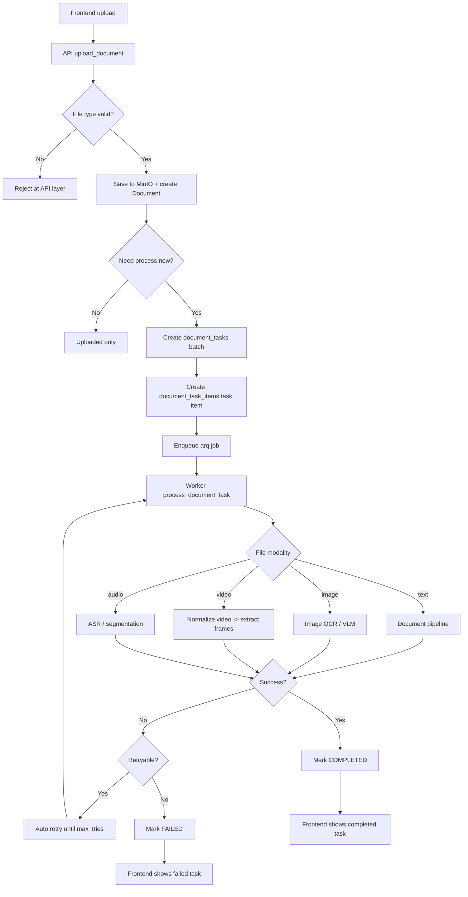

# Document Processing Flow

## Overview

## Key Tables

- `document_tasks`: batch header
- `document_task_items`: real execution items
- `documents`: file metadata only

## Retry Rule

- Auto retry happens inside the worker
- Manual retry creates a new batch and a new task item
- Deterministic validation errors should be rejected before entering worker
